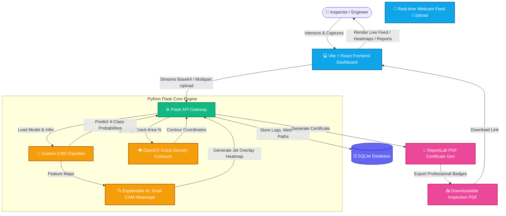

# 🛡️ APEX-AI: Deep-Learning Smart Crack Detection & Structural Health Monitoring

[](https://www.python.org/)
[](https://tensorflow.org/)
[](https://reactjs.org/)
[](https://flask.palletsprojects.com/)
[](https://opencv.org/)
[](https://sqlite.org/)

An advanced, premium, interdisciplinary engineering project combining **Deep Learning (Custom Convolutional Neural Networks)**, **Explainable AI (Grad-CAM)**, **Computer Vision (OpenCV Contour Analysis)**, and a **High-Performance React Dashboard** to automate structural damage inspections and provide real-time severity classification.

---

## 📸 System Architecture & Data Flow

This diagram illustrates how data flows seamlessly between the user, frontend, backend API, deep learning inference engine, and the visual/analytical post-processing pipelines.



---

## 🌟 Core System Features

*   **⚡ Real-Time Webcam Audit Scanner:** Tap into live computer/device camera feeds, capture high-resolution frames, run immediate analysis, and log inspector comments synchronously.
*   **👁️ Explainable AI (XAI) Grad-CAM Heatmaps:** Highlights the exact visual coordinates that triggered the CNN's classification. Transparent overlays show the examiner why the network reached its conclusion.
*   **📐 OpenCV Crack Density Quantification:** Measures the exact percentage of the concrete surface affected by fractures using adaptive thresholding, morphological closing, and contour integrations.
*   **📊 4-Class Severity Grading Engine:** Automatically classifies damages into:
    *   🟢 **No Crack:** Safe, continue routine structural inspections.
    *   🟡 **Minor:** Low priority, surface hairline fractures.
    *   🟠 **Moderate:** Medium priority, schedule physical engineer checks.
    *   🔴 **Severe:** High danger! Triggers immediate structural alerts & evacuation recommendations.
*   **📄 PDF Report Generator:** Generates comprehensive, client-ready inspection certificates featuring color-coded severity badges, comparative original/annotated thumbnails, key metrics, and actionable engineering recommendations.
*   **🗄️ SQLite Database Inspection Logs:** Fully audit-logged inspections. View, search, analyze, and manage histories on the database logs view.
*   **🎓 Interactive College Viva Classroom:** Explains CNN layers, pooling benefits, activation operations, and lists frequently asked examiner questions with optimized textbook answers.

---

## 📂 Project Structure

```
apex-ai/
├── backend/
│   ├── app.py                  # Main Flask application entrypoint
│   ├── database/
│   │   ├── db.py               # SQLite database initializer
│   │   └── models.py           # Database CRUD methods & ORM helpers
│   ├── model/
│   │   ├── crack_model.py      # TF Keras model loading & multi-class inference
│   │   └── preprocess.py       # Image resizing, normalization, & Base64 decoding
│   ├── routes/
│   │   ├── camera.py           # API endpoint for live webcam captures
│   │   ├── detection.py        # API endpoint for manual image uploads
│   │   ├── history.py          # API endpoints for CRUD database logs
│   │   └── report.py           # API endpoint for ReportLab PDF generation
│   └── utils/
│       ├── generate_dummy_model.py # Script compiling and saving baseline crack_cnn.h5
│       ├── heatmap.py          # Grad-CAM matrix computation & Jet overlay
│       ├── pdf_generator.py    # Custom ReportLab canvas styling & flowable layouts
│       └── severity.py         # OpenCV image thresholding & severity scoring rule logic
│
├── ai_training/
│   ├── train.py                # Deep learning custom CNN training pipeline
│   ├── data_loader.py          # SDNET2018 / Custom Concrete dataset ingestion
│   ├── augmentation.py         # Keras real-time zoom, tilt, flip, & noise injects
│   └── evaluate.py             # Generates confusion matrices & F1 classification reports
│
├── frontend/
│   ├── src/                    # React codebase (components, dashboards, views)
│   ├── index.html              # Custom page container & responsive metadata
│   ├── vite.config.ts          # Vite bundler, proxy configuration & TypeScript rules
│   └── package.json            # Node dependencies (Lucide-React, Axios, Tailwind)
│
├── trained_model/
│   └── .gitkeep                # Core target location for tensorflow .h5 models
│
├── .gitignore                  # Keeps codebase lightweight, ignoring binary outputs
├── requirements.txt            # Python dependencies (TensorFlow, OpenCV, Flask, ReportLab)
└── README.md                   # Highly detailed, professional system documentation
```

---

## 🛠️ Step-by-Step Installation

### 1. Pre-requisites
Ensure you have **Python 3.10+** and **Node.js 18+** installed on your system.

### 2. Python Backend Setup
Open a terminal in the root directory:
```bash
# 1. Create a virtual environment (optional but highly recommended)
python -m venv venv
venv\Scripts\activate   # On Windows
source venv/bin/activate # On macOS/Linux

# 2. Install all required Python packages
pip install -r requirements.txt

# 3. Create environmental parameters configuration
copy .env.example .env   # On Windows
cp .env.example .env     # On macOS/Linux
```

### 3. Generate Baseline Model File (Fast Demo Setup)
Rather than waiting to download massive 40,000 image datasets to start testing, compile and generate a mathematically correct model instantly to test the full stack right away:
```bash
python backend/utils/generate_dummy_model.py
```
*This compiles a custom CNN and saves `crack_cnn.h5` inside `./trained_model/`, allowing you to run predictions instantly.*

### 4. Boot Up Flask API Server
```bash
python backend/app.py
```
*The engine is now online at `http://localhost:5000`.*
*Verify health check at: `http://localhost:5000/api/health`*

### 5. Start React Dashboard Frontend
Open a new terminal window in the `frontend/` folder:
```bash
cd frontend
npm install
npm run dev
```
*Your React Dashboard is now live at `http://localhost:5173`!*

---

## 🎓 College Viva & Theoretical Core Guide

> [!NOTE]
> Review this section thoroughly before presenting your project in any academic viva-voce or board assessment.

### 🧠 Model CNN Details & Layer Mechanics
*   **Input Dimensions:** `[224, 224, 3]` (Standard RGB shape).
*   **Feature Extraction:** Features 4 cascading `Conv2D` blocks with expanding kernels (`32 ➔ 64 ➔ 128 ➔ 256`) to extract features ranging from high-level micro-fissure line structures down to low-level concrete surface textures.
*   **Batch Normalization & Regularization:** `BatchNormalization` is placed after each Conv layer to stabilize activations, reduce covariate shift, and accelerate convergence. Spatial `Dropout` (`0.25` up to `0.50`) is added to prevent overfitting.
*   **Global Average Pooling (GAP):** Uses `GlobalAveragePooling2D` rather than a raw `Flatten` layer. GAP reduces a `[7, 7, 256]` feature map down to `[256]` by taking the mean of each spatial channel, saving over 8 million parameters while preserving spatial relationships—essential for Grad-CAM.

### 🔬 Explainable AI (XAI) via Grad-CAM
*   **How it works:** Gradients of the target output class score are computed with respect to the final convolutional layer's feature maps. 
*   **Jet Map Overlay:** These gradients are average-pooled to find the neuron weights, combined linearly, passed through a `ReLU` activation (retaining only features that positively influence the target class), and upsampled back to `224x224` to overlay a colorful heat map on the original concrete photo.

### 🔬 OpenCV Crack Density Quantification
1.  **Grayscale & Gaussian Blur:** Removes colored sensor noise, retaining structural intensity.
2.  **Adaptive Thresholding:** Compares every pixel against its local neighborhood, separating deep, shadowed crack crevices from surface concrete discoloration and uneven lighting.
3.  **Morphological Closing:** A combination of dilation followed by erosion using a small structuring element. This fills in microscopic pixel gaps to reconstruct continuous, connected fractures.
4.  **Contour Integrations:** Sums up the area of black pixel components against the absolute viewport dimensions to calculate the exact percentage of surface damage:
    $$\text{Crack Density } (\%) = \left( \frac{\text{Area of Crack Contours}}{\text{Total Image Resolution}} \right) \times 100$$

---

## 🚀 Key Viva Questions (Quick Reference)

| Question | Short Professional Answer |
| :--- | :--- |
| **Why Flask instead of Django?** | Flask is a lightweight micro-framework, making it faster and highly optimal for real-time model inference endpoints without unnecessary overhead. |
| **What is the benefit of GAP over Flatten?** | GAP keeps the parameter count low, prevents overfitting, and bridges the gap between feature map channels and final class activations, which is mathematically required for Grad-CAM. |
| **Why combine Deep Learning and OpenCV?** | CNNs excel at **classification** (identifying *if* there is a crack and its type), while OpenCV excels at **exact spatial quantification** (measuring the pixel-level surface area occupied by the damage). |
| **What is the database schema?** | A single `inspections` table in SQLite tracking: `id`, `original_path`, `annotated_path`, `crack_detected`, `severity`, `confidence`, `crack_area_pct`, `recommendation`, `location_tag`, `notes`, `source`, and `timestamp`. |

---

## 📝 Future Production Checklist
If preparing this for commercial/industrial field integration:
1.  **Deployment:** Deploy Flask to a Render/Railway/AWS instance, and the React Dashboard to Vercel/Netlify.
2.  **Cloud Storage:** Replace local disk paths with secure AWS S3 bucket links for original and annotated inspection images.
3.  **Active Alerts:** Integrated SMTP / Twilio APIs to send real-time SMS or email warnings to supervisors when `Critical` severity structural damage is logged.
